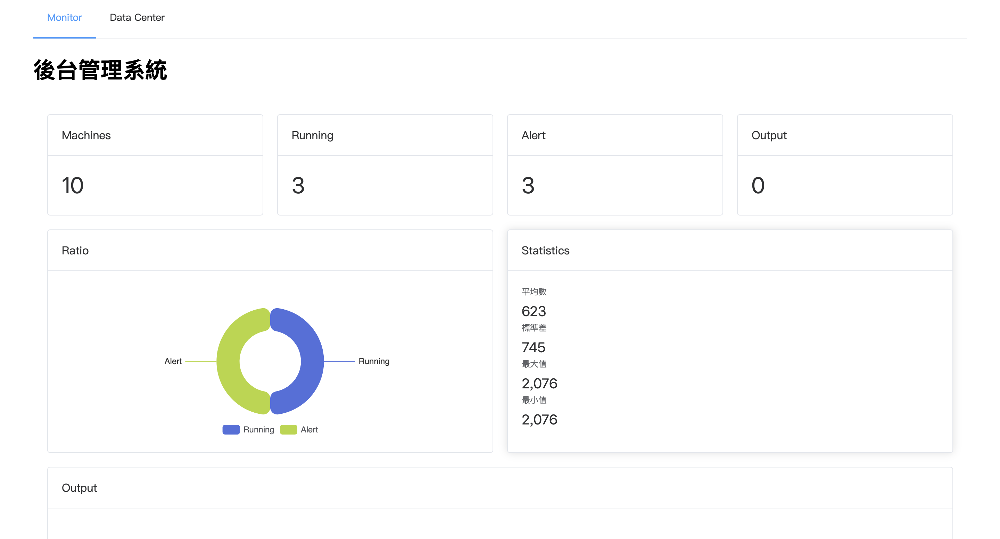
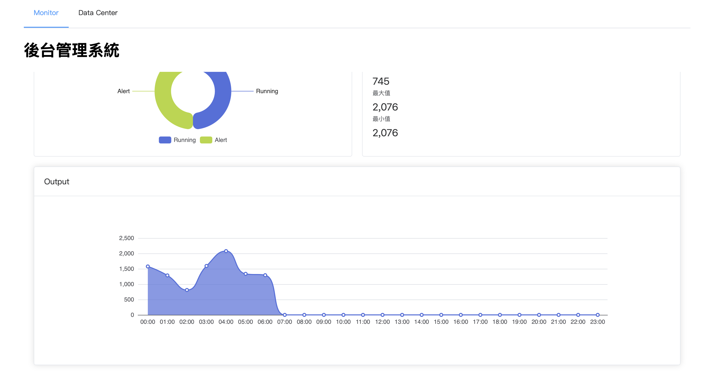
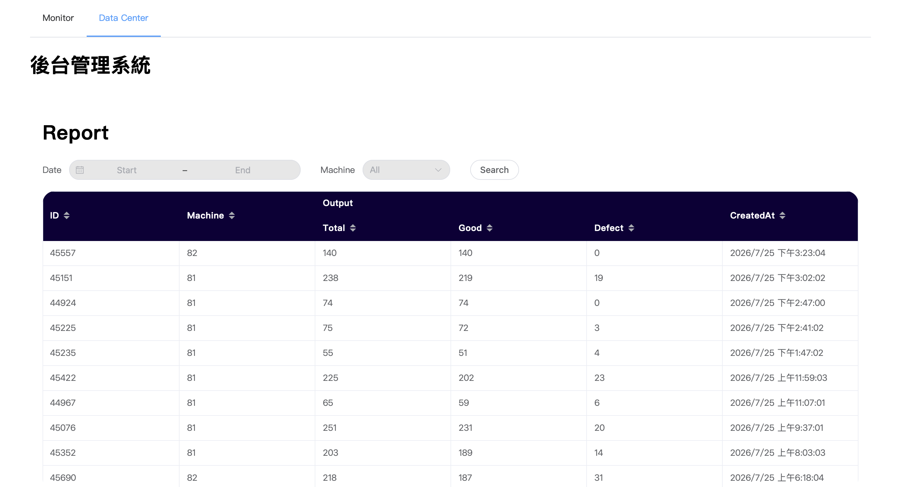

# Factory Monitor Platform


工廠生產監控與報表管理系統。

以工廠生產資料為情境，打造一套前後端分離的平台，
提供設備狀態監控、生產統計、歷史報表與資料視覺化功能。

## Demo

- Frontend: [Factory Monitor Demo](https://factory-frontend-vue.onrender.com/monitor)

## Features

### Production Monitor
- 設備運行狀態監控
- 生產數量統計
- 良率與不良率分析
- ECharts 資料視覺化

### Production Data
- 生產紀錄查詢
- 日期區間篩選
- 機台條件篩選
- 表格資料展示

## Screenshots







## Tech Stack

- Vue 3
- TypeScript
- Vite
- Pinia
- Element Plus
- ECharts
- Axios


## Architecture

- Frontend / Backend separation
- RESTful API integration
- State management with Pinia
- Component-based architecture
- Responsive dashboard layout

## Development

Install dependencies

```bash
npm install
```

Run development server

```bash
npm run dev
```

Build for production

```bash
npm run build
```

## Deployment

- Hosted on Render